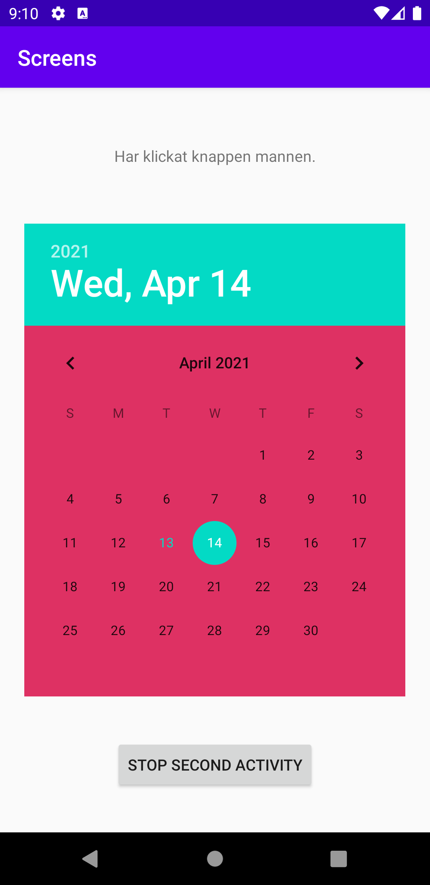

# Rapport
Först skapades en ny activity genom att klicka på file -> new -> activity -> empty activity vilket skapade en java fil, en tillhörande xml fil och la till klassen i manifestet.
sedan skapades en `button` i _activity_main.xml_ och en `Button` samt en `TextView` i _activity_second.xml_ som alla fick egna id.
```xml
    <Button
        android:id="@+id/start_second"
        android:layout_width="wrap_content"
        android:layout_height="wrap_content"
        android:text="@string/start_second_activity"
        app:layout_constraintBottom_toBottomOf="parent"
        app:layout_constraintLeft_toLeftOf="parent"
        app:layout_constraintRight_toRightOf="parent"
        app:layout_constraintTop_toTopOf="parent" />
```
```xml
    <TextView
        android:id="@+id/second_text"
        android:layout_width="wrap_content"
        android:layout_height="wrap_content"
        android:text="Hello World!"
        app:layout_constraintBottom_toTopOf="@+id/fragment"
        app:layout_constraintLeft_toLeftOf="parent"
        app:layout_constraintRight_toRightOf="parent"
        app:layout_constraintTop_toTopOf="parent" />
    <Button
        android:id="@+id/stop_second"
        android:layout_width="wrap_content"
        android:layout_height="wrap_content"
        android:text="@string/stop_second_activity"
        app:layout_constraintBottom_toBottomOf="parent"
        app:layout_constraintLeft_toLeftOf="parent"
        app:layout_constraintRight_toRightOf="parent"
        app:layout_constraintTop_toBottomOf="@+id/fragment" />
```
Efter det skapades det en variabel av typen `Button` vid namn **startSecond** som tilldelades knappen i _activity_main.xml_ via dess id. **startSecond** gavs en ny `OnClickLinstener` som med hjälp av en variabel av typen intent ändrar från `MainActivity` till `SecondActivity` när man klickar på knappen.
den skickar även extra information vid namn **second_text** i form av en string.
```java
        Button startSecond = findViewById(R.id.start_second);
        startSecond.setOnClickListener(new View.OnClickListener() {
            @Override
            public void onClick(View v) {
                Intent intent = new Intent(MainActivity.this, SecondActivity.class);
                intent.putExtra("second_text","Har klickat knappen mannen.");
                startActivity(intent);
            }
        });
```
sedan i _SecondActivity.java_ skapades en variabel för `TextView` elementet som finns i _activity_second.xml_  och med hjälp av ett `Bundle` element som hämtar extra informationen som skickas med och lägger in texten som skickats i `TextView` element som skapats.
det skapades även en variabel för knappen från _activity_second.xml_ som används fär att avsluta lystnandet på knappen tidigare. 
```java
        TextView secondText = findViewById(R.id.second_text);
        Bundle extras = getIntent().getExtras();
        if (extras != null) {
            String text = extras.getString("second_text");
            secondText.setText(text);
        }

        Button startSecond = findViewById(R.id.stop_second);
        startSecond.setOnClickListener(new View.OnClickListener() {
            @Override
            public void onClick(View v) {
                finish();
            }
        });
```
sedan skapades ett fragment via file -> new -> fragment -> fragment(blank) och dess xml fil lades till i _activity_second.xml_ i en fragment tagg med sökvägen till dess java kod som namn och ett id för om den skule användas i koden.
```xml
    <fragment
        android:id="@+id/fragment"
        android:name="com.example.screens.BlankFragment"
        android:layout_width="match_parent"
        android:layout_height="wrap_content"
        app:layout_constraintBottom_toBottomOf="parent"
        app:layout_constraintLeft_toLeftOf="parent"
        app:layout_constraintRight_toRightOf="parent"
        app:layout_constraintTop_toTopOf="parent"/>
```
sist lades det till ett `DatePicker` element i _fragment_blank.xml_ som gavs färgen från ett nytt element i _colors.xml_ vid namn **Cerise** som gavs den heaxadecimala färgkod för cerise.
```xml
    <DatePicker
        android:id="@+id/calendar"
        android:layout_width="wrap_content"
        android:layout_height="wrap_content"
        android:background="@color/Cerise"
        android:layout_gravity="center"/>
```

_**Första skärmen**_

_**Andra skärmen**_